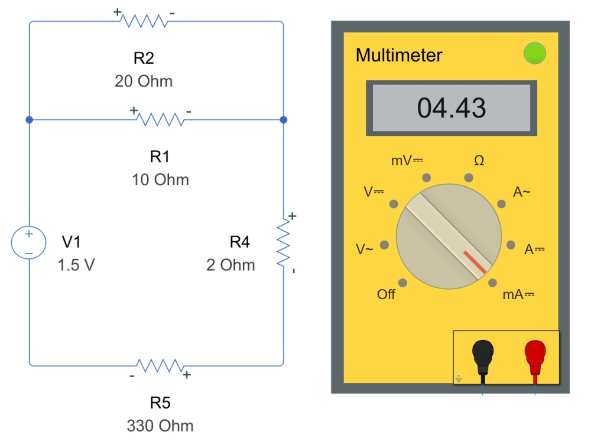

# Electricity & Magnetism: Introduction

# Information

This curriculum module contains interactive [MATLAB® live scripts](https://www.mathworks.com/products/matlab/live-editor.html) that provides supplementary examples and visualizations to enhance understanding of electricity and magnetism principles, specifically focusing on common application like capacitors and DC motors.

## Background

These live scripts can be used as demonstrations in lectures, class activities, or interactive assignments outside class. This module covers electric fields and charge, magnetic fields and current, and the governing physical equations of electricity and magnetism. It also includes examples of applications like DC motors, capacitors, and magnetic braking.

The instructions inside the live scripts will guide you through the exercises and activities. Get started with each live script by running it one section at a time. To stop running the script or a section midway (for example, when an animation is in progress), use the  Stop button in the **RUN** section of the **Live Editor** tab in the MATLAB Toolstrip.

## Contact Us

Solutions are available upon instructor request. Contact the [MathWorks teaching resources team](mailto:onlineteaching@mathworks.com) if you would like to provide feedback, or if you have a question.

## Prerequisites

This module assumes knowledge of basic calculus and introductory physics, including mechanics and fundamental concepts of electricity and magnetism.

## Getting Started
### Accessing the Module
### **On MATLAB Online:**

Use the  link to download the module. You will be prompted to log in or create a MathWorks account. The project will be loaded, and you will see an app with several navigation options to get you started.

### **On Desktop:**

Download or clone this repository. Open MATLAB, navigate to the folder containing these scripts and double\-click on [emag.prj](https://matlab.mathworks.com/open/github/v1?repo=MathWorks-Teaching-Resources/Electricity-Magnetism&project=emag.prj&file=README.mlx). It will add the appropriate files to your MATLAB path and open an app that asks you where you would like to start. 

Ensure you have all the required products ([listed below](#H_E850B4FF)) installed. If you need to include a product, add it using the Add\-On Explorer. To install an add\-on, go to the **Home** tab and select   **Add-Ons** > **Get Add-Ons**. 

## Products

MATLAB® is used throughout the module along with the following products:

Simulink®

Symbolic Math Toolbox™

Simscape™

# Scripts

**Capacitors series**

|||
| :-- | :-- |
|     | [**CapacitorsFundamental.mlx**](https://matlab.mathworks.com/open/github/v1?repo=MathWorks-Teaching-Resources/Electricity-Magnetism&project=emag.prj&file=Scripts/CapacitorsFundamentals.mlx)   **In this script, students will...**   $\bullet$ Explore the fundamental principles and applications of capacitors in electrical circuits.   $\bullet$ Analyze the relationship between capacitors and electric fields, including their role in storing and releasing electrical energy.     |
|     | [**CapacitorsChargeDischarge.mlx**](https://matlab.mathworks.com/open/github/v1?repo=MathWorks-Teaching-Resources/Electricity-Magnetism&project=emag.prj&file=Scripts/CapacitorsChargeDischarge.mlx)   **In this script, students will...**   $\bullet$ Analyze energy storage in capacitors and evaluate its applications in circuits.   $\bullet$ Simulate the charge and discharge of capacitors to demonstrate their role.     |

# License

The license for this module is available in the [LICENSE.md](https://github.com/MathWorks-Teaching-Resources/Electricity-Magnetism/blob/release/LICENSE.md).

# Related Courseware Modules

## [DC Circuit Analysis](https://matlab.mathworks.com/open/github/v1?repo=MathWorks-Teaching-Resources/DC-Circuit-Analysis&project=DCCircuitAnalysis.prj&file=README.mlx)
|||
| :-- | :-- |
|     | **Available on:**         [GitHub](https://github.com/MathWorks-Teaching-Resources/DC-Circuit-Analysis)     |

## [Virtual Measurement of Electron charge\-to\-mass ratio lab](https://matlab.mathworks.com/open/github/v1?repo=MathWorks-Teaching-Resources/Virtual-Measurement-of-the-Electron-Charge-To-Mass-Ratio-Lab&project=virtual-measurement-of-the-electron-charge-to-m.prj&file=README.mlx)
|||
| :-- | :-- |
|     | **Available on:**         [GitHub](https://github.com/MathWorks-Teaching-Resources/Virtual-Measurement-of-the-Electron-Charge-To-Mass-Ratio-Lab)     |

Or feel free to explore our other [modular courseware content](https://www.mathworks.com/matlabcentral/fileexchange/?q=tag%3A%22courseware+module%22&sort=downloads_desc_30d).

# Educator Resources
-  [Educator Page](https://www.mathworks.com/academia/educators.html) 

# Contribute 

Looking for more? Find an issue? Have a suggestion? Please contact the [MathWorks teaching resources team](mailto:%20onlineteaching@mathworks.com). If you want to contribute directly to this project, you can find information about how to do so in the [CONTRIBUTING.md](https://github.com/MathWorks-Teaching-Resources/Electricity-Magnetism/blob/release/CONTRIBUTING.md)  page on GitHub.

 *©* Copyright 2025 The MathWorks, Inc

